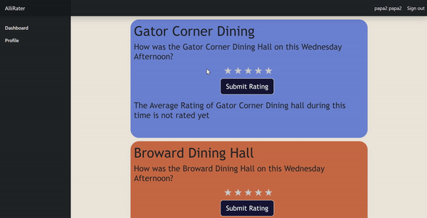

# AlliRater
## CEN3031: Intro to Software Engineering Semester Project

UF students can rate the meal they just had at the dining hall using AlliRater. Students can also access the current meal ratings for the particular dining hall that they want to go to in order to determine if they should spend the money and time to go there.



**Created by:** Natalie Kwak, Macguire McDuff, Brenda Nakasone, Lauren Nunag


-----------------------------

## INSTALLATION INSTRUCTIONS

Want to see AlliRater on your own machine? 
Make sure to have Node.js installed and your favorite text editor.
Clone the repository add open in said favorite text editor.
Open an integrated terminal on the angular-admin folder (or change the directory to the angular-admin folder: ```cd .../AlliRater/angular-admin``` ) and perform the following commands in order:
```
npm install
```
```
npm install @angular/cli -g
```
Start the site by running:
```
ng serve 
```
You can browse to the site by instead running ```ng serve --open``` or navigating to ```http://localhost:4200/``` after the previous step.

Using Node v18.15.0, npm v9.6.2, and Angular v15.2.6

-----------------------------

## COMMON ERRORS

When trying to run ng serve on ```angular-admin``` for the first time, you are most likely going to encounter an error similar to the following: ```Error: Can't resolve 'node_modules/material-design-icons/iconfont/material-icons.css' in '.../code/AlliRater/angular-admin'```

To resolve this:
Open an integrated terminal on the angular-admin folder (or change the directory to the angular-admin folder: ```cd .../AlliRater/angular-admin``` ) if not already there. Run the following command in the terminal:
```
npm install material-design-icons-iconfont
```

Next, navigate to and open the following file to edit: ```.../AlliRater/angular-admin/mode_modules/material-design-icons/iconfont/material-icons.css```

The first 11 lines of this file should read:
```
@font-face {
  font-family: 'Material Icons';
  font-style: normal;
  font-weight: 400;
  src: url(MaterialIcons-Regular.eot); /* For IE6-8 */
  src: local(Material Icons),
       local(MaterialIcons-Regular),
       url(MaterialIcons-Regular.woff2) format('woff2'),
       url(MaterialIcons-Regular.woff) format('woff'),
       url(MaterialIcons-Regular.ttf) format('truetype');
}
```

Make changes to the file so that you have single quotes wrapping each url as such:
```
@font-face {
  font-family: 'Material Icons';
  font-style: normal;
  font-weight: 400;
  src: url('MaterialIcons-Regular.eot'); /* For IE6-8 */
  src: local('Material Icons'),
       local('MaterialIcons-Regular'),
       url('MaterialIcons-Regular.woff2') format('woff2'),
       url('MaterialIcons-Regular.woff') format('woff'),
       url('MaterialIcons-Regular.ttf') format('truetype');
}
```

Save the file and try running ```ng serve``` again. Open the app by browsing to ```http://localhost:4200/```.
